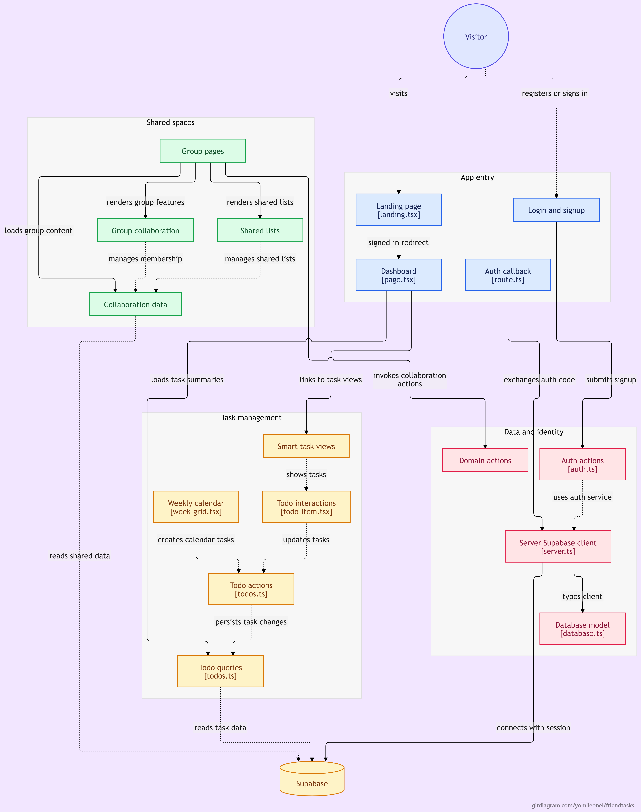

# PlanyourTasks

Todo-App für Freundeskreise: persönliche Aufgaben, geteilte Gruppen- und Listen-Workflows, Wochenkalender, Benachrichtigungen in Echtzeit. Gebaut mit Next.js und Supabase.



## Funktionen

### Konto & Profil
- Registrierung, Anmeldung, Passwort-Reset, Passwort-Sichtbarkeit umschaltbar
- Anzeigename und Wiedererkennungsfarbe (sichtbar in Mitgliederlisten und bei Zuweisungen)
- Konto inkl. aller Daten vollständig und unwiderruflich löschbar
- Deutsch/Englisch umschaltbar, Dark Mode manuell umschaltbar, responsive (Sidebar am Desktop, ausklappbares Menü am Handy)

### Persönliche Todos
- Titel, Beschreibung, Fälligkeitsdatum, Start- und Endzeit, Priorität, Tags, Unteraufgaben
- Wiederkehrende Todos: wöchentlich (auch an mehreren Wochentagen gleichzeitig) oder monatlich, mit optionalem Enddatum; erledigte Vorkommen bleiben im Kalender sichtbar
- Duplizieren als Vorlage, Schnell-Hinzufügen per Texteingabe ("Müll rausbringen jeden Montag 18 Uhr #WG @Max")
- Dateianhänge und Kommentare pro Todo
- Smart Lists: Heute, Diese Woche, Ohne Datum, Alle, jeweils mit Suche und Filter (Status, Priorität, Tag)
- Dashboard mit Kennzahlen, "Achtung"-Banner für überfällige/bald fällige Todos
- Wochenkalender: Stundenraster mit durchgehenden Balken für mehrstündige Termine, Auswahl-Dialog bei zeitlich überschneidenden Todos, Klick zum direkten Eintragen

### Gruppen
- Erstellen, per Einladungslink beitreten (mit Bestätigung durch den Admin), Mitglieder verwalten
- Geteilte Todo-Listen mit Mehrfachzuweisung, optional "offen für alle" (ohne festen Owner)
- Sub-Listen zur Strukturierung innerhalb einer Gruppe
- Nur der Admin kann beliebige Todos löschen, ein Mitglied nur seine eigenen
- Aktivitätsprotokoll, gemeinsame Notizen (z. B. WLAN-Passwort)

### Persönliche geteilte Listen
- Eine Liste mit einzelnen Freunden teilen, unabhängig von Gruppen, ebenfalls per Einladungslink mit Bestätigung
- Eingeladene Mitglieder sehen die Liste, können aber keine Todos anlegen, bearbeiten oder löschen (nur der Besitzer)

### Benachrichtigungen
- In-App, in Echtzeit (ohne Neuladen), mit Sound-Effekt
- Gebündelt bei mehreren Ereignissen zum selben Todo/zur selben Gruppe
- Klick führt direkt zur betroffenen Gruppe/Liste statt zu einer allgemeinen Übersicht

## Tech-Stack

- [Next.js](https://nextjs.org) (App Router, Server Actions)
- [Supabase](https://supabase.com) (Postgres, Auth, Row Level Security, Realtime, Storage)
- [Tailwind CSS](https://tailwindcss.com)
- [Zod](https://zod.dev) für Validierung

## Projekt starten

Der eigentliche Code liegt im Unterordner [`friendtasks/`](friendtasks). Details zum lokalen Setup, zum Anlegen des Supabase-Projekts und zum Ausführen der Datenbank-Migrationen stehen in [`friendtasks/docs/supabase-setup.md`](friendtasks/docs/supabase-setup.md).

```bash
cd friendtasks
npm install
npm run dev
```

## Architektur

Die Grafik oben zeigt den groben Aufbau: Einstieg über Landing-Page/Login, Task-Management (Smart Lists, Kalender, Todo-Aktionen) und geteilte Bereiche (Gruppen, Listen, Mitgliederverwaltung) greifen beide über die Server-Actions/Datenzugriffsschicht auf Supabase zu.

## Hintergrund

Die vollständige Anforderungsanalyse (Requirements Engineering) liegt in [`friendtasks/docs/todo-app-requirements.md`](friendtasks/docs/todo-app-requirements.md).
